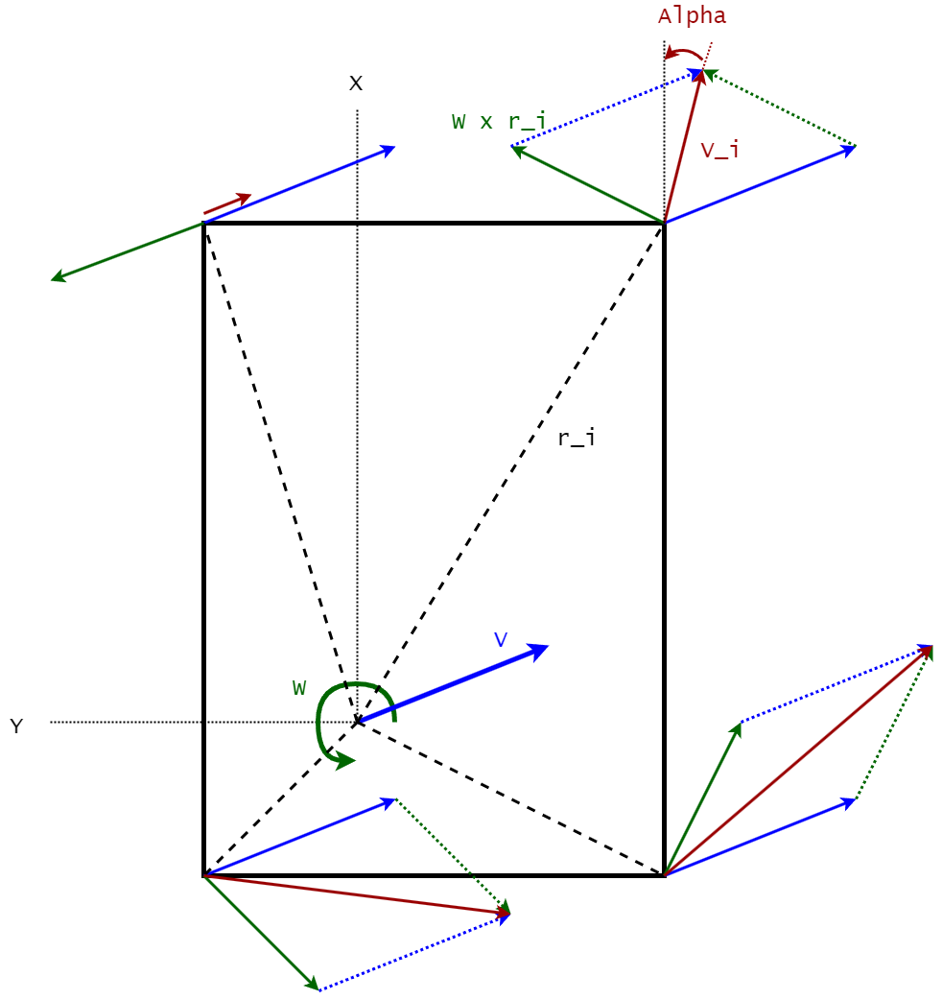

# basic-swerve-sim

This package contains Python code that simulates the state of a wheeled mobile robot which has all wheel drive
and all wheel steering. This kind of drive system is known as a swerve drive. The code was developed to provide
an insight into how the different drive modules in a swerve drive have to behave in order to get the desired
body motions. In this context a drive module consists of a wheel and the mechanical and electrical parts to make the
wheel rotate forwards and backwards as well as controlling the steering angle of the wheel.

## Running the scripts

There are three different scripts in this repository that each provide different information. These scripts are:

* `run_trajectory_simulation.py` - This script runs a simulation of the robot body and drive modules in response to a
  series of movement commands. The script will output the state of the robot body and the drive modules at each step in
  time.
* `run_motion_profiles.py` - This script calculates the behaviour of a values for a number of motion profiles.
* `run_verification.py` - This script runs a series of tests to verify that the code is working as expected.

### Trajectory simulation

### Motion profiles

### Verification

## Overview

In order to run this simulation the code needs to determine both the inverse kinematics and the forward kinematics
behaviour of the system. The inverse kinematics calculations determines the behaviour of the drive modules based on the
desired movement state of the robot body. The forward kinematics calculations determine the movement of the robot body
based on the behaviour of the drive modules.

Because there are more degrees of freedom in the drive modules than there are physical degrees of freedom the controller
code has to ensure that the drive modules are synchronised otherwise one or more drive modules will experience wheel
slip which is undesirable. In relation to this it should be noted that not all drive module motions turn into a body motion,
but all body motions turn into drive module motions. For example turning the drive modules but not driving the wheels,
i.e. no wheel velocity, leads to a change in the state of the drive modules, but no state change for the robot body. This
indicates that the simulation code needs to both be able to work with commands that direct body movement and commands
that direct drive module movement.

Finally in real life the motors that are part of the drive modules have limitations that affect what kind of movement
profiles can be achieved, e.g. a motor will have a maximum rotational acceleration, thus limiting how fast a velocity
changes can be achieved.

The simulation determines the behaviour of a swerve drive in response to one or more movement commands executed over a
period of time. In order to achieve this there are three parts to the simulation.

* The **model** describes the forward and inverse kinematics necessary to calculate the behaviour of the robot body
  and the drive modules in response to a movement command.
* The **controller** is responsible for calculating the movement profiles necessary to move from the current state to
  the desired state.
* The **wrapper** collects the movement commands from the user, iterates between the movement commands and finally
  stores the calculated information in files.

## Models

The [model](swerve_controller/control_model.py) describes the inverse and forward kinematics. There are many different
algorithms available in the literature. At the moment the following algorithms are implemented:

* A [simple kinematics model](https://www.chiefdelphi.com/t/paper-4-wheel-independent-drive-independent-steering-swerve/107383/5)

In the future the aim is to also implement a 3D force based model devised by
[Neal Seegmiller](https://scholar.google.co.nz/citations?hl=en&user=H10kxZgAAAAJ&view_op=list_works&sortby=pubdate) and
described in the following papers:

* [Dynamic Model Formulation and Calibration for Wheeled Mobile Robots - 2014](https://scholar.google.co.nz/citations?view_op=view_citation&hl=en&user=H10kxZgAAAAJ&sortby=pubdate&citation_for_view=H10kxZgAAAAJ:ufrVoPGSRksC)
* [Enhanced 3D kinematic modeling of wheeled mobile robots - 2014](https://scholar.google.co.nz/citations?view_op=view_citation&hl=en&user=H10kxZgAAAAJ&sortby=pubdate&citation_for_view=H10kxZgAAAAJ:YsMSGLbcyi4C)
* [Recursive kinematic propagation for wheeled mobile robots - 2015](https://scholar.google.co.nz/citations?view_op=view_citation&hl=en&user=H10kxZgAAAAJ&sortby=pubdate&citation_for_view=H10kxZgAAAAJ:Y0pCki6q_DkC)
* [High-Fidelity Yet Fast Dynamic Models of Wheeled Mobile Robots - 2016](https://scholar.google.co.nz/citations?view_op=view_citation&hl=en&user=H10kxZgAAAAJ&sortby=pubdate&citation_for_view=H10kxZgAAAAJ:Y0pCki6q_DkC)

### Simple kinematics model

The simple kinematic model is derived from the 2D geometric relations between the robot rotational centre and the position,
angle and velocity of the drive modules. This model makes the following assumptions

* The drive modules are connected to the robot body in a fixed location and at a fixed angle.
* There is no suspension in the drive modules.
* The robot is moving on a flat, horizontal surface.
* The wheel steering axis for a drive module goes through the centre of the wheel in a vertical direction, so the wheel
  contact point is always inline with the steering axis.

The following image shows these relationships between the robot body degrees of freedom and the drive module degrees of
freedom.

<figure
    style="float:left"
    width="560"
    height="315">

<figcaption>Kinematics diagram for the multi-wheel steering controller</figcaption>
</figure>

In this image the variables are as follows:

* `V` - The linear velocity vector for the robot body, consisting of `V_x`, the velocity in the x direction, and `V_y`,
  the velocity in the y direction.
* `W` - The rotational velocity for the robot body. Due to the 2D nature of the model this variable is a scalar not a
  vector. The rotational velocity is taken as positive going counter clock-wise.
* `r_i` - The position vector of the i-th drive module relative to the robot rotational centre.
* `alpha_i` - The angle in radians of the i-th drive module as measured in the coordinate system for that drive module.
  The angle is measured as positive going counter-clock wise from the x-axis of the drive module coordinate system. Note
  that the `alpha_i` angle in the image signifies a negative angle.
* `v_i` - The velocity of the contact patch between the ground and the wheel of the i-th drive module, measured in meters
  per second. It should be noted that this is a scalar value, not a vector.

For these variables it is important to note that all coordinate system related variables are measured in the robot
coordinate system unless otherwise specified.

Note that the rotational centre for the robot is generally either the middle or the centre of gravity, however this does
is not required for this model to work. The rotational centre can be placed anywhere. It could theoretically be moved
around over the course of time, however the current implementation does not allow for changes to the rotational centre.

By using the information displayed in the image we can derive the following equations for the relation between the
velocity of the robot body and the velocity and angle of each drive module.

    v_i = v + W x r_i

    alpha = acos (v_i_x / |v_i|)
          = asin (v_i_y / |v_i|)

To make both the forward and inverse kinematics calculations possible it is better to put these equations in a matrix
equation as follows. The state of the drive modules can be found with the following equation:

    V_i = |A| * V

where

* `V` - The state vector for the robot body = `[v_x, v_y, w]^T`
* `|A|` - The state matrix that translates the body state to the drive module state
* `V_i` - The state vector for the drive modules = `[v_1_x, v_1_y, v_2_x, v_2_y, ... , v_n_x, v_n_y]^T`

The state matrix is an `[2 * n ; 3]` matrix where `n` is the number of drive modules. For the current example this is:

    [
        1.0   0.0   -module_1.y
        0.0   1.0   module_1.x
        1.0   0.0   -module_2.y
        0.0   1.0   module_2.x
        1.0   0.0   -module_3.y
        0.0   1.0   module_3.x
        1.0   0.0   -module_4.y
        0.0   1.0   module_4.x
    ]

In order to determine the robot body motion from the drive module state we can invert the equation

    V = |A|^-1 * V_i

It should be noted that this will be an overdetermined system, there are `n * 2` values available and three variables
(`v_x, v_y, w`). Thus the inverse of `|A|` needs to be the [pseudo-inverse](https://en.wikipedia.org/wiki/Moore%E2%80%93Penrose_inverse)
of `|A|` which provides a least-squares fit of the values to the available variables.

## Controllers

The [controller](swerve_controller/multi_wheel_steering_controller.py) is responsible for planning the profile that each
drive module should follow to move the robot from the current movement state to the desired movement state. Currently
the following controllers are implemented:

* A controller that controls the robot through the drive modules and assumes linear behaviour for the drive modules. In
  other words the controller will plan a linear profile from the current state to the desired state.

In the future the aim is to implement additional controllers that use control profiles which are more realistic.

## Simulation wrapper

The [simulation wrapper](run_trajectory_simulation.py) code collects the movement information from the user and translates
this into commands for the controller. Once it has collected the commands it iterates over these commands, collecting
the state of the robot body and the drive modules at each step in time.

## Testing

All models and controllers are tested with the following series of standard motion commands.

* Move in the x-direction without changing orientation:
  * Starting state: Robot oriented in the x-direction, standing still. Drive modules all at 0 rad (0 degrees), i.e. facing
    in body x-direction.
  * Movement command: Velocity in the x-direction of 1.0 m/s, to be achieved in 1 second.
* Move in the y-direction without changing orientation:
  * Starting state: Robot oriented in the x-direction, standing still. Drive modules all at 1.57 rad (90 degrees), i.e.
    facing in the body y-direction.
  * Movement command: Velocity in the y-direction of 1.0 m/s, to be achieved in 1 second.
* Move diagonally the xy-direction without changing orientation:
  * Starting state: Robot oriented in the x-direction, standing still. Drive modules all at 0.785 rad (45 degrees), i.e
    facing in the xy diagonal direction.
  * Movement command: Velocity in the x-direction of 0.707 m/s and y-direction of 0.707 m/s, to be achieved in 1 second.
* Rotate around the robot rotation centre:
  * Starting state: Robot oriented in the x-direction, standing still. Drive modules at:
    * Left front: 2.356 rad (135 degrees)
    * Left rear: 3.927 rad (225 degrees)
    * Right rear: 5.498 rad (315 degrees)
    * Right front: 0.785 rad (45 degrees)
  * Movement command: Rotational velocity of 1.0 rad/s, to be achieved in 1 second.
